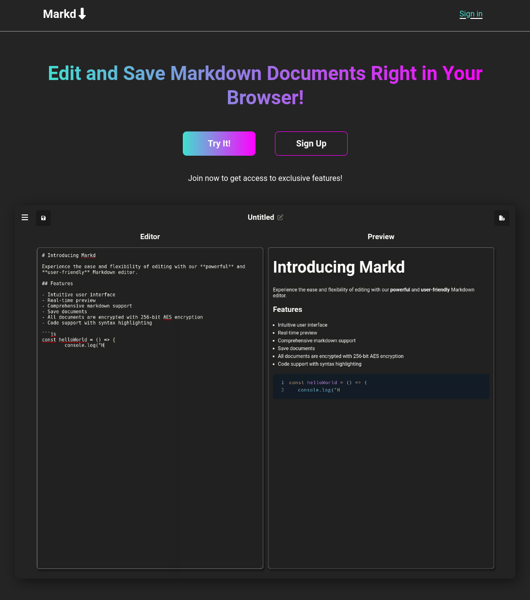

# Markd   

## Description

Markd is an in-browser Markdown editor. I created this project as my first full stack application
using a BaaS (Firebase). A lot was learned from making this project -- I will include details in a later section.
The goals of this project were to:

1. Create a full-stack application with Firebase
2. Build something that I would find potentially useful, even if just for myself and not a wider audience
3. Keep a clean uncluttered UI

## Table of Contents

- [Installation](#installation)

- [Usage](#usage)

- [Credits](#credits)

- [What I Learned](#lessons)

## Installation

> Note: To use this app locally, you will need a .env file at the root of the project directory with the necessary API keys for Firebase.

Clone this repository to a local directory, move into the directory, and install the dependencies

```bash
git clone https://github.com/nronzel/markdown-editor.git

cd markdown-editor

npm install
```

To run the local dev server

```bash
npm run dev
```

Navigate to `localhost:5173` in your browser to view the site.

To build and preview the production build of the app

```bash
npm run build
npm run preview
```

Navigate to `localhost:4173` in your browser to view the site.

## Usage

You can try it out with the button on the home page. If you would like to save your documents for later retrieval or updating your can create
an account, set your encryption key, and your documents will be encrypted and saved with AES 256-bit encryption.



## Credits

[React Markdown](https://github.com/remarkjs/react-markdown)


## Lessons

I wrote a lot of this project with Chakra UI components, and then realized after a few hours that Chakra overrides the CSS that
gets generated by the Markdown. I tried using Chakra's builtin component to prevent the CSS from being overwritten, but it didn't work.

I opted to just re-write the app with CSS. I am not the best web designer, so I went with a very basic colorscheme and layout.

Once the authentication was implemented with Firebase, I noticed that the document contents got stored in plaintext in the database. Not good.
I decided to implement encryption using the Web Crypto API. My implementation takes a given encryption password from the user, hashes it and stores the hash in the database, and uses the hash to
encrypt/decrypt the markdown data with AES-256.

It took some time to get it implemented and I had to recruit the help of ChatGPT for some of the implementation.

Getting the backend set up was actually really easy with Firebase. The documentation does a good job explaining how to implement the various features.

One major lesson I learned from this project is to focus on getting the main functionality there first, THEN worry about details. I got lost in the encryption of the data
before all of the functionality was even present, and it definitely cost me more time and headaches than it should have.

---
